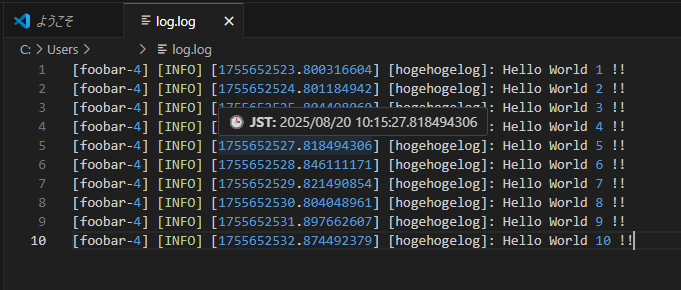

# unixtimeconverter README

Unix時間を日時に変換する拡張機能です

## 機能

- マウスオーバーによる日時変換

- 右クリック > 「すべてのUnix時間を日付に変換する」 でテキスト内の全ての数値を日時に変換
- 選択した状態で 右クリック > 「選択範囲のUnix時間を日時に変換」 で選択した範囲の数値を日時に変換

## 注意点
- 設定した閾値（UnixTimeConveter.threshold）以上の数値を変換します。その数値がunix時間であるかどうかは関係なく閾値以上は全て日時に変換されます。
- 負の時刻(1970/1/1 0:00:00以前)は対応していません
- Unix時刻はUTC, 変換後の日時はJSTを前提に製作しています。